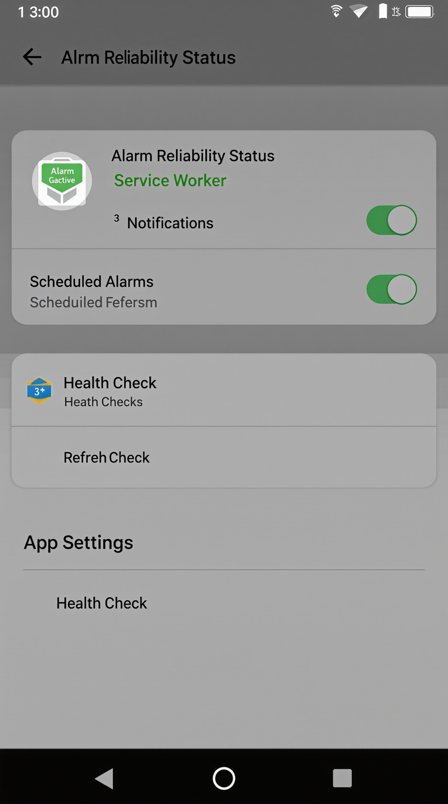

# Testing the ServiceWorkerStatus Integration

## 📱 Visual Preview



## Quick Test Guide

### 1. Navigate to Settings

1. Open the Relife app
2. Click on the **Settings** tab in the bottom navigation
3. You should now see the **"Alarm Reliability Status"** section at the top

### 2. Check Service Worker Status

The status card should show:

**🟢 Service Worker: Active** - Service worker is running in background  
**🟢 Notifications: Granted** - System notifications are enabled  
**🔢 Scheduled Alarms: X** - Number of alarms scheduled in background  
**📅 Last Check: [timestamp]** - When the system last verified alarm health

### 3. Test Different States

#### Initial State (Not Initialized)

- Service Worker: **Inactive** (Red badge)
- Notifications: **Not Set** (Gray badge)
- Shows error message if service worker fails to load

#### Permission Denied State

- Service Worker: **Active** (Green badge)
- Notifications: **Denied** (Red badge)
- Shows "Enable" button to request permissions

#### Fully Active State

- Service Worker: **Active** (Green badge)
- Notifications: **Granted** (Green badge)
- Shows current scheduled alarm count
- Green success message at bottom

### 4. Test Interactive Features

#### Enable Notifications Button

1. If notifications show "Not Set" or "Denied"
2. Click the **"Enable"** button next to the notification status
3. Browser should prompt for notification permission
4. Status should update to "Granted" after accepting

#### Health Check Button

1. Click **"Health Check"** button
2. System verifies all alarms are properly scheduled
3. Updates the "Last Check" timestamp
4. May show any discovered issues in error messages

#### Refresh Button

1. Click **"Refresh"** button
2. Reloads current service worker state
3. Updates all status indicators
4. Useful if something seems out of sync

### 5. Test Alarm Integration

#### Create an Alarm

1. Click the **"+"** button to create a new alarm
2. Set it for 2 minutes from now
3. Save the alarm
4. Return to Settings → Check "Scheduled Alarms" count increased

#### Service Worker Sync

1. The status should automatically update when alarms change
2. "Scheduled Alarms" count should reflect current enabled alarms
3. Changes happen in real-time without manual refresh

### 6. Test Cross-Tab Reliability

#### Tab Switch Test

1. Create an alarm for 1 minute from now
2. Switch to a different browser tab
3. Wait for alarm time
4. Notification should appear even on the other tab
5. Clicking notification should focus the alarm app

#### Browser Minimized Test

1. Create an alarm for 1 minute from now
2. Minimize the entire browser
3. Wait for alarm time
4. System notification should appear
5. Clicking notification should restore and focus browser

## 🔧 Developer Testing

### Console Logging

Open browser DevTools (F12) and check console for:

```
ServiceWorkerManager: Initialization complete
App: Syncing X alarms with enhanced service worker
Enhanced SW: Alarm X scheduled successfully
```

### Service Worker DevTools

1. DevTools → **Application** tab
2. Click **Service Workers** in sidebar
3. Should show `sw-enhanced.js` as **activated and running**
4. Can see service worker console logs there

### Network Status

1. Disconnect internet
2. Service worker status should still show as **Active**
3. Alarms should continue to work offline
4. Reconnecting should sync any changes

## 🐛 Troubleshooting Common Issues

### Service Worker Shows "Inactive"

- Check browser console for errors
- Try refreshing the page
- Verify service worker file exists at `/public/sw-enhanced.js`
- Some browsers block service workers on localhost - try HTTPS

### Notifications Show "Denied"

- Check browser notification settings
- Clear site data and re-grant permissions
- Some browsers require user gesture before permission request

### Scheduled Alarms Count is Wrong

- Click "Health Check" to verify alarm state
- Check console for sync errors
- Try creating a new alarm to test sync

### Health Check Fails

- Check browser console for detailed error messages
- Verify service worker is active in DevTools
- Try refreshing the page to reinitialize

## ✅ Success Criteria

The integration is working correctly when:

1. **Status displays properly** - All badges show correct states
2. **Real-time updates** - Changes reflect immediately when alarms are added/removed
3. **Permissions work** - Enable button successfully requests notifications
4. **Health monitoring** - Health check updates timestamp and reports status
5. **Cross-tab alarms** - Alarms fire reliably even when switching tabs
6. **Error handling** - Clear error messages appear when issues occur

## 📊 Expected Benefits

Users should experience:

- **Confidence** - Visual confirmation that alarms will work reliably
- **Control** - Easy access to enable permissions and check system health
- **Transparency** - Clear visibility into background alarm scheduling
- **Reliability** - Alarms that fire consistently regardless of browser tab management

The ServiceWorkerStatus component provides the missing piece for user trust in the alarm system reliability!
