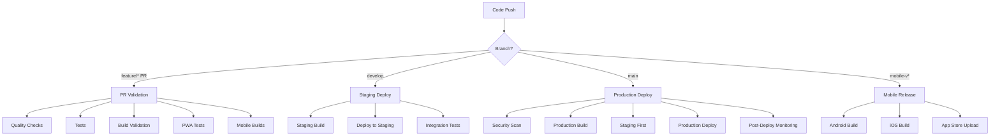

# CI/CD Pipeline Guide

Comprehensive guide to the Relife app's continuous integration and deployment system.

## Overview

The Relife app uses GitHub Actions for a complete CI/CD pipeline supporting web, mobile, and infrastructure deployments with automated testing, security scanning, and monitoring.

## Pipeline Architecture



## Workflows

### 1. Pull Request Validation (`.github/workflows/pull-request.yml`)

**Triggers:**
- Pull requests to `main` or `develop`
- Manual workflow dispatch

**Jobs:**
- **Code Quality:** ESLint, TypeScript, formatting, security audit
- **Tests:** Unit tests with coverage reporting
- **Build Validation:** Web app build and bundle size check
- **PWA Validation:** Progressive Web App compliance testing
- **Mobile Builds:** Android APK and iOS build validation
- **Accessibility:** WCAG compliance testing
- **Performance:** Bundle analysis and Lighthouse scoring
- **PR Summary:** Automated results comment

**Configuration:**
```yaml
# Skip for draft PRs unless manually triggered
# Parallel execution for faster feedback
# Comprehensive artifact collection
# Automated PR comments with results
```

### 2. Staging Deployment (`.github/workflows/staging-deploy.yml`)

**Triggers:**
- Push to `develop` branch
- Manual workflow dispatch with environment selection

**Environments:**
- `staging` - Main staging environment
- `dev` - Development testing environment

**Process:**
1. Build with staging configuration
2. Deploy to selected environment
3. Health checks and warm-up
4. Lighthouse performance audit
5. PWA and accessibility testing
6. Integration testing with external services
7. 5-minute monitoring period

**URLs:**
- Staging: `https://staging.relife.app`
- Dev: `https://dev.relife.app`

### 3. Production Deployment (`.github/workflows/deploy-production.yml`)

**Triggers:**
- Push to `main` branch
- Version tags (`v*`)
- Manual workflow dispatch

**Security-First Approach:**
1. **Security Scanning:** Dependency audit, Snyk analysis
2. **Quality Gates:** Linting, TypeScript, comprehensive testing
3. **Staged Deployment:** Staging first, then production
4. **Monitoring:** Performance tracking, error monitoring

**Features:**
- Multi-platform Docker builds (amd64, arm64)
- Automatic rollback capability
- Sentry integration for error tracking
- Performance budget enforcement
- Slack notifications

### 4. Mobile Release (`.github/workflows/mobile-release.yml`)

**Triggers:**
- Mobile version tags (`mobile-v*`)
- Manual workflow dispatch

**Platforms:**
- Android: APK and AAB builds for Google Play
- iOS: IPA builds for App Store and TestFlight

**Release Types:**
- `internal` - Internal testing
- `alpha` - Alpha testing with external users
- `beta` - Beta testing for wider audience
- `production` - Public app store release

**Capabilities:**
- Automated version bumping
- Code signing for both platforms
- App store deployment
- Release notes generation
- Multi-platform artifact creation

## Environment Configuration

### Secrets Required

#### Web Deployment
```
SUPABASE_URL                    # Production Supabase URL
SUPABASE_ANON_KEY              # Production Supabase anonymous key
SUPABASE_URL_STAGING           # Staging Supabase URL  
SUPABASE_ANON_KEY_STAGING      # Staging Supabase anonymous key
POSTHOG_KEY                    # PostHog analytics key
POSTHOG_KEY_STAGING           # PostHog staging key
SENTRY_DSN                    # Sentry error tracking DSN
SENTRY_DSN_STAGING           # Sentry staging DSN
SENTRY_AUTH_TOKEN            # Sentry API token
SENTRY_ORG                   # Sentry organization
```

#### Mobile Signing
```
# Android
ANDROID_KEYSTORE_BASE64       # Base64 encoded release keystore
ANDROID_STORE_PASSWORD        # Keystore password
ANDROID_KEY_ALIAS            # Key alias
ANDROID_KEY_PASSWORD         # Key password
GOOGLE_PLAY_SERVICE_ACCOUNT_JSON  # Google Play Console service account

# iOS  
IOS_TEAM_ID                  # Apple Developer Team ID
IOS_DISTRIBUTION_CERTIFICATE # Base64 encoded distribution certificate
IOS_CERTIFICATE_PASSWORD     # Certificate password
IOS_PROVISIONING_PROFILE     # Base64 encoded provisioning profile
IOS_KEYCHAIN_PASSWORD        # CI keychain password
APPLE_ID_EMAIL               # Apple ID for App Store uploads
APPLE_ID_PASSWORD            # App-specific password
```

#### Monitoring & Notifications
```
SLACK_WEBHOOK_URL            # Slack notifications
DATADOG_WEBHOOK              # Datadog monitoring
UPTIME_WEBHOOK_URL          # Uptime monitoring
PERFORMANCE_ENDPOINT         # Performance tracking API
ANALYTICS_ENDPOINT           # Analytics API
LHCI_GITHUB_APP_TOKEN       # Lighthouse CI GitHub app
```

### Environment Variables

#### Build-time Configuration
```bash
VITE_APP_VERSION             # App version
VITE_BUILD_TIME             # Build timestamp
VITE_ENVIRONMENT            # Environment (staging/production)
VITE_API_URL               # API base URL
VITE_PERFORMANCE_MONITORING # Enable performance monitoring
```

## Quality Gates

### Code Quality Standards
- **ESLint:** Zero warnings policy
- **TypeScript:** Strict mode, no errors
- **Prettier:** Consistent code formatting
- **Security:** No high-severity vulnerabilities

### Testing Requirements
- **Unit Tests:** Minimum 80% coverage
- **Integration Tests:** All API endpoints
- **E2E Tests:** Critical user journeys
- **Accessibility:** WCAG 2.1 AA compliance

### Performance Budgets
- **Performance Score:** ≥80 (Lighthouse)
- **PWA Score:** ≥85 (Lighthouse)
- **Bundle Size:** ≤10MB total
- **First Contentful Paint:** ≤2s
- **Largest Contentful Paint:** ≤3s
- **Cumulative Layout Shift:** ≤0.1

### Mobile Requirements
- **Android:** Min SDK 23, Target SDK 35
- **iOS:** Deployment target 13.0+
- **Build Success:** All platforms must build
- **Security:** Signed releases only

## Monitoring and Alerting

### Application Monitoring
- **Sentry:** Error tracking and performance monitoring
- **PostHog:** User analytics and feature flags
- **DataDog:** Infrastructure monitoring
- **Uptime Monitoring:** 24/7 availability tracking

### Performance Tracking
- **Web Vitals:** Core performance metrics
- **Lighthouse CI:** Automated performance audits
- **Bundle Analysis:** Size and composition tracking
- **Mobile Performance:** App store performance metrics

### Alert Configuration
```yaml
Severity Levels:
  Critical: Production outages, security breaches
  High: Performance degradation, failed deployments  
  Medium: Test failures, dependency vulnerabilities
  Low: Code quality issues, documentation updates

Notification Channels:
  - Slack: #deployments, #alerts
  - Email: Development team
  - SMS: On-call engineer (critical only)
```

## Workflow Commands

### Manual Workflow Triggers

#### PR Validation
```bash
# Trigger validation for draft PR
gh workflow run pull-request.yml
```

#### Staging Deployment
```bash
# Deploy to staging
gh workflow run staging-deploy.yml

# Deploy to dev environment  
gh workflow run staging-deploy.yml -f environment=dev

# Force deploy (skip tests)
gh workflow run staging-deploy.yml -f force_deploy=true
```

#### Production Deployment
```bash
# Production deployment
gh workflow run deploy-production.yml -f environment=production

# Emergency deployment (skip tests)
gh workflow run deploy-production.yml -f skip_tests=true
```

#### Mobile Release
```bash
# Build both platforms for beta
gh workflow run mobile-release.yml -f platform=both -f release_type=beta -f version_bump=minor

# Android only for internal testing
gh workflow run mobile-release.yml -f platform=android -f release_type=internal
```

### NPM Scripts

#### Development
```bash
npm run dev                  # Start development server
npm run build               # Build for production
npm run preview             # Preview production build
```

#### Testing
```bash
npm run test                # Run unit tests
npm run test:watch          # Run tests in watch mode
npm run test:coverage       # Run tests with coverage
npm run test:pwa           # Run PWA compliance tests
npm run test:lighthouse     # Run Lighthouse audits
```

#### Code Quality
```bash
npm run lint               # Run ESLint
npm run lint:fix           # Fix ESLint issues
npm run type-check         # TypeScript type checking
npm run format             # Format code with Prettier
```

#### Mobile
```bash
npm run sign:android       # Setup Android signing
npm run sign:ios          # Setup iOS signing  
npm run sign:validate     # Validate signing configuration
npm run build:android:release  # Build signed Android APK
npm run build:android:bundle   # Build Android App Bundle
npm run build:ios:archive     # Build iOS archive
```

#### CI/CD
```bash
npm run ci:validate        # Run all CI validation steps
npm run ci:build          # Build all platforms
npm run ci:test           # Run all tests
```

## Troubleshooting

### Common Issues

#### Build Failures
```bash
# Clear caches
rm -rf node_modules dist .next
npm ci

# Check TypeScript
npx tsc --noEmit

# Validate configuration
npm run sign:validate
```

#### Test Failures
```bash
# Run tests locally
npm test -- --verbose

# Update snapshots
npm test -- --updateSnapshot

# Check coverage
npm run test:coverage
```

#### Mobile Build Issues
```bash
# Sync Capacitor
npx cap sync

# Clean builds
cd android && ./gradlew clean
cd ios && rm -rf build/

# Validate signing
npm run sign:validate
```

#### Deployment Issues
```bash
# Check environment variables
gh secret list

# View workflow logs
gh run list --workflow=deploy-production.yml
gh run view [run-id] --log

# Manual rollback
gh workflow run deploy-production.yml -f environment=production
```

### Debug Mode

Enable debug logging by setting:
```bash
ACTIONS_STEP_DEBUG=true
ACTIONS_RUNNER_DEBUG=true
```

### Performance Debugging

#### Lighthouse CI Issues
```bash
# Run locally
npm run test:lighthouse

# Check configuration
cat lighthouserc.json

# Debug server startup
npx serve dist -p 3000 --debug
```

#### Bundle Analysis
```bash
# Analyze bundle size
npm run build -- --analyze

# Check dependencies
npm ls --depth=0
npm audit
```

## Security

### Secrets Management
- Use GitHub Secrets for sensitive data
- Rotate secrets regularly
- Use environment-specific secrets
- Never commit secrets to code

### Security Scanning
- Automated dependency scanning with Dependabot
- Snyk security analysis in CI
- Docker image scanning
- Code analysis for sensitive data

### Access Control
- Branch protection rules enforced
- Required reviews for production changes
- Deployment approvals for environments
- Audit logging for all deployments

## Best Practices

### Branch Strategy
```
main          -> Production deployments
develop       -> Staging deployments  
feature/*     -> Feature development
hotfix/*      -> Emergency fixes
release/*     -> Release preparation
```

### Commit Conventions
```
feat: new feature
fix: bug fix
docs: documentation
style: formatting
refactor: code restructuring
test: adding tests
chore: maintenance
ci: CI/CD changes
```

### Release Process
1. Feature development in feature branches
2. PR validation and review
3. Merge to develop for staging testing
4. Release branch for final preparation
5. Merge to main for production deployment
6. Tag release for mobile deployment

## Maintenance

### Regular Tasks
- [ ] Review Dependabot PRs weekly
- [ ] Monitor performance trends monthly
- [ ] Update security configurations quarterly
- [ ] Review and update documentation
- [ ] Rotate secrets annually

### Monitoring Dashboard Links
- [GitHub Actions](https://github.com/Coolhgg/Relife/actions)
- [Lighthouse CI](https://app.netlify.com/sites/relife-lighthouse)
- [Sentry Dashboard](https://sentry.io/organizations/relife/projects/relife-app/)
- [PostHog Analytics](https://app.posthog.com/project/relife)

## Support

### Getting Help
- **Documentation:** This guide and linked resources
- **Issues:** GitHub Issues for bugs and features
- **Discussions:** GitHub Discussions for questions
- **Security:** security@relife.app for security issues

### Contributing to CI/CD
- Follow existing patterns in workflows
- Test changes in feature branches
- Update documentation for new features
- Consider backward compatibility