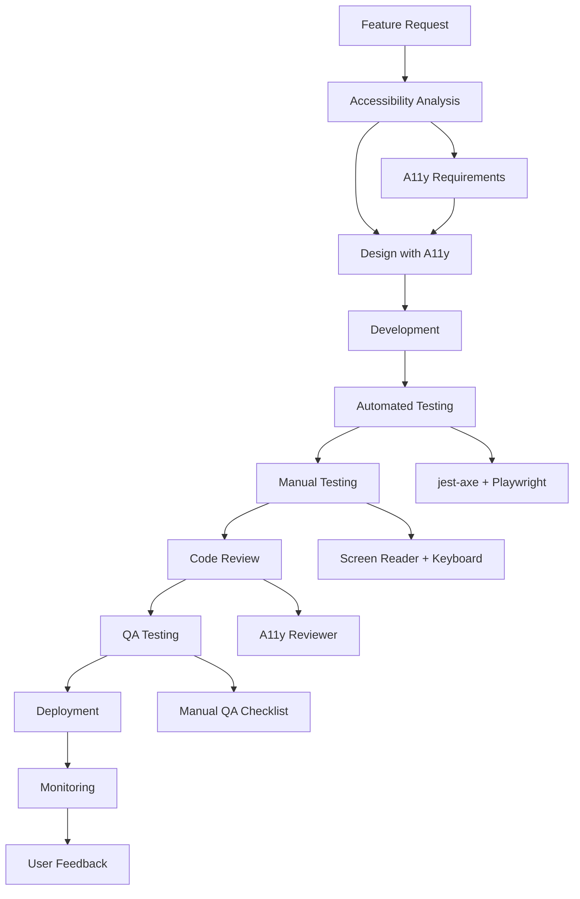

# Accessibility Developer Workflow 🔄

**Complete guide to accessibility-first development in the Relife Alarm App**

This guide establishes the complete development workflow that ensures accessibility is built-in from design to deployment, not retrofitted as an afterthought.

## Table of Contents

- [Development Workflow](#development-workflow)
- [Pre-Development](#pre-development)
- [During Development](#during-development)
- [Testing & QA](#testing--qa)
- [Code Review Process](#code-review-process)
- [Deployment & Monitoring](#deployment--monitoring)
- [Team Training](#team-training)
- [Tools & Setup](#tools--setup)

---

## Development Workflow

### 🎯 Overview

Our accessibility-first workflow ensures every feature is accessible from conception to production. The process is designed to catch accessibility issues early when they're easier and cheaper to fix.



---

## Pre-Development

### 📋 Accessibility Requirements Gathering

Before writing any code, establish accessibility requirements:

```markdown
## Accessibility Analysis Template

### Feature: [Feature Name]
### Type: [UI Component / Page / Flow / Integration]

#### WCAG 2.1 AA Requirements:
- [ ] Perceivable: What visual/audio elements need alternatives?
- [ ] Operable: What keyboard/touch interactions are needed?
- [ ] Understandable: What language/instructions are required?
- [ ] Robust: What assistive technology support is needed?

#### User Impact:
- Screen Reader Users: [Impact and requirements]
- Keyboard-Only Users: [Impact and requirements]
- Motor Impaired Users: [Impact and requirements]
- Vision Impaired Users: [Impact and requirements]
- Cognitive Differences: [Impact and requirements]

#### Acceptance Criteria:
- [ ] Component is keyboard navigable
- [ ] Screen reader announces purpose and state
- [ ] Color contrast meets 4.5:1 minimum
- [ ] Touch targets are 44x44px minimum
- [ ] Works with voice control software
- [ ] Error states are clearly communicated

#### Testing Strategy:
- Unit Tests: [Jest-axe test coverage]
- E2E Tests: [Playwright scenarios]
- Manual Tests: [Screen reader/keyboard scenarios]
```

### 🎨 Accessible Design Collaboration

Work with designers to ensure accessible foundations:

**Design Review Checklist:**
- [ ] **Color Contrast**: All text meets WCAG AA standards (4.5:1 normal, 3:1 large)
- [ ] **Focus Indicators**: Clear focus states for all interactive elements
- [ ] **Touch Targets**: Minimum 44x44px for mobile interactions
- [ ] **Typography**: Readable fonts, adequate line spacing, reasonable line length
- [ ] **Information Hierarchy**: Clear heading structure and logical flow
- [ ] **Error States**: Visual and text-based error communication
- [ ] **Loading States**: Clear progress indicators and status messages
- [ ] **Responsive Design**: Usable at all viewport sizes and zoom levels

**Design System Integration:**
```tsx
// Ensure design tokens include accessibility considerations
const designTokens = {
  colors: {
    // Contrast-compliant color pairs
    textOnLight: '#1a1a1a', // 4.5:1 on white
    textOnDark: '#ffffff',  // 21:1 on black
    error: '#dc2626',       // 4.5:1 on white
    // Focus indicator colors
    focusRing: '#3b82f6',
  },
  spacing: {
    // Touch target minimum
    touchTarget: '44px',
    // Focus ring thickness
    focusRing: '2px',
  },
  typography: {
    // Relative units for user scaling
    body: '1rem',    // 16px base
    large: '1.125rem', // 18px
  }
};
```

---

## During Development

### 🛠️ Development Environment Setup

Configure your environment for accessibility-first development:

```bash
# Install accessibility development tools
npm install -D @axe-core/react axe-core
npm install -D eslint-plugin-jsx-a11y
npm install -D @storybook/addon-a11y

# Browser extensions (install manually)
# - axe DevTools (Chrome/Firefox)
# - WAVE Web Accessibility Evaluator
# - Colour Contrast Analyser
# - Accessibility Insights for Web
```

**VS Code Extensions:**
```json
{
  "recommendations": [
    "deque-systems.vscode-axe-linter",
    "streetsidesoftware.code-spell-checker",
    "bradlc.vscode-tailwindcss",
    "ms-vscode.vscode-typescript-next"
  ]
}
```

### 💻 Coding Standards

Follow accessibility-first coding patterns:

**1. Semantic HTML First**
```tsx
// ✅ Good: Semantic elements with ARIA enhancements
<button 
  onClick={handleSubmit}
  disabled={isLoading}
  aria-describedby="submit-help"
>
  {isLoading ? 'Submitting...' : 'Submit'}
</button>

// ❌ Bad: Non-semantic elements with complex ARIA
<div 
  role="button"
  tabIndex={0}
  onClick={handleSubmit}
  onKeyDown={handleKeyDown}
  aria-describedby="submit-help"
>
  Submit
</div>
```

**2. Progressive Enhancement**
```tsx
// Build components that work without JavaScript
const AlarmToggle = ({ alarm, onToggle }) => {
  // Works as checkbox without JavaScript
  return (
    <label className="alarm-toggle">
      <input
        type="checkbox"
        checked={alarm.enabled}
        onChange={(e) => onToggle(alarm.id, e.target.checked)}
        className="sr-only"
      />
      <span className="toggle-visual" aria-hidden="true" />
      <span className="toggle-label">
        {alarm.enabled ? 'Enabled' : 'Disabled'}
      </span>
    </label>
  );
};
```

**3. Focus Management**
```tsx
// Manage focus in SPAs and dynamic content
const Modal = ({ isOpen, onClose, children }) => {
  const modalRef = useRef<HTMLDivElement>(null);
  const previousFocus = useRef<HTMLElement>();
  
  useEffect(() => {
    if (isOpen) {
      // Store current focus
      previousFocus.current = document.activeElement as HTMLElement;
      
      // Focus modal
      modalRef.current?.focus();
      
      // Trap focus within modal
      const trapFocus = (e: KeyboardEvent) => {
        if (e.key === 'Tab') {
          // Focus trap logic
        }
      };
      
      document.addEventListener('keydown', trapFocus);
      
      return () => {
        document.removeEventListener('keydown', trapFocus);
        // Restore focus
        previousFocus.current?.focus();
      };
    }
  }, [isOpen]);
  
  return isOpen ? (
    <div 
      ref={modalRef}
      role="dialog"
      aria-modal="true"
      tabIndex={-1}
    >
      {children}
    </div>
  ) : null;
};
```

### 🧪 Test-Driven Accessibility

Write accessibility tests alongside feature development:

```tsx
// Write accessibility tests first
describe('AlarmForm Accessibility', () => {
  it('should be keyboard navigable', async () => {
    render(<AlarmForm />);
    
    // Test tab order
    const timeInput = screen.getByLabelText('Alarm Time');
    const nameInput = screen.getByLabelText('Alarm Name');
    const submitButton = screen.getByRole('button', { name: 'Create Alarm' });
    
    // Verify tab order
    userEvent.tab();
    expect(timeInput).toHaveFocus();
    
    userEvent.tab();
    expect(nameInput).toHaveFocus();
    
    userEvent.tab();
    expect(submitButton).toHaveFocus();
  });
  
  it('should pass axe accessibility tests', async () => {
    await axeRender(<AlarmForm />);
  });
  
  it('should handle errors accessibly', async () => {
    render(<AlarmForm />);
    
    // Submit empty form
    const submitButton = screen.getByRole('button', { name: 'Create Alarm' });
    userEvent.click(submitButton);
    
    // Verify error announcement
    const errorMessage = await screen.findByRole('alert');
    expect(errorMessage).toBeInTheDocument();
    
    // Verify error association
    const nameInput = screen.getByLabelText('Alarm Name');
    expect(nameInput).toHaveAttribute('aria-invalid', 'true');
    expect(nameInput).toHaveAccessibleDescription('Name is required');
  });
});
```

### 🔄 Continuous Testing

Run accessibility tests during development:

```bash
# Quick accessibility check during development
npm run test:a11y:unit --watch

# Check specific component
npm run test:a11y:unit -- AlarmForm

# Full accessibility suite
npm run test:a11y:all

# Generate accessibility report
npm run a11y:report
```

---

## Testing & QA

### 🤖 Automated Testing Strategy

**Unit Level (jest-axe):**
```bash
# Test individual components
npm run test:a11y:unit

# Coverage goals:
# - 90% of interactive components tested
# - All form components tested
# - All modal/dialog components tested
```

**Integration Level (Playwright + axe):**
```bash
# Test complete user flows
npm run test:a11y:e2e

# Coverage goals:
# - All critical user journeys tested
# - Cross-page navigation tested
# - Dynamic content updates tested
```

**Production Level (Lighthouse + pa11y):**
```bash
# Production accessibility audits
npm run test:a11y:lighthouse
npm run test:a11y:pa11y

# Acceptance criteria:
# - Lighthouse score ≥ 90
# - Zero WCAG 2.1 AA violations
# - Performance impact < 5%
```

### 🎭 Manual Testing Protocol

**Daily Developer Testing:**
```bash
# 5-minute accessibility check for new features:

1. Keyboard Navigation (2 minutes)
   - Tab through entire interface
   - Test Enter/Space on interactive elements
   - Verify Escape closes modals/menus
   - Check focus indicators are visible

2. Screen Reader Smoke Test (2 minutes)
   - Enable VoiceOver/NVDA
   - Navigate to new feature
   - Verify purpose is announced
   - Check form labels are read correctly

3. Visual Check (1 minute)
   - Zoom to 200%
   - Check contrast with browser tools
   - Verify touch targets on mobile
```

**Weekly Comprehensive Testing:**
- Complete manual QA checklist
- Test with multiple screen readers
- Cross-browser accessibility verification
- Mobile accessibility testing

---

## Code Review Process

### 👥 Accessibility Code Review

**Required for all PRs touching UI:**

**Reviewer Checklist:**
```markdown
## Accessibility Review Checklist

### Code Quality
- [ ] Semantic HTML used appropriately
- [ ] ARIA attributes are necessary and correct
- [ ] Focus management implemented for dynamic content
- [ ] Keyboard event handlers present where needed
- [ ] Color contrast meets requirements
- [ ] Text alternatives provided for non-text content

### Testing
- [ ] Jest-axe tests pass
- [ ] Playwright accessibility tests pass
- [ ] Manual testing completed (see PR description)
- [ ] No new accessibility violations introduced

### Standards Compliance
- [ ] WCAG 2.1 AA guidelines followed
- [ ] Component follows established patterns
- [ ] Documentation updated if needed
- [ ] Breaking changes documented and justified

### Performance
- [ ] Accessibility features don't negatively impact performance
- [ ] Bundle size impact is reasonable
- [ ] No unnecessary re-renders caused by accessibility updates
```

**Review Comments Templates:**
```markdown
# Missing alt text
Please add appropriate alt text to this image. For decorative images, use `alt=""`.

# Poor color contrast
This color combination doesn't meet WCAG AA standards (4.5:1). Please use a darker color or add additional visual indicators.

# Missing form labels
This input needs a proper label. Consider using a `<label>` element or `aria-label` attribute.

# Focus management issue
When this modal opens, focus should move to the first interactive element. Consider using `useEffect` to manage focus.

# Keyboard accessibility missing
This custom component needs keyboard event handlers. Interactive elements should respond to Enter and Space keys.
```

### 🔍 Automated Review Gates

**CI/CD Pipeline:**
```yaml
# .github/workflows/accessibility-review.yml
name: Accessibility Review

on:
  pull_request:
    paths: ['src/**', 'tests/**']

jobs:
  accessibility-gate:
    runs-on: ubuntu-latest
    steps:
      - uses: actions/checkout@v4
      - name: Run accessibility tests
        run: npm run test:a11y:all
      - name: Check accessibility gate
        run: npm run a11y:gate
      - name: Comment PR with results
        uses: actions/github-script@v7
        with:
          script: |
            // Post accessibility report to PR
```

---

## Deployment & Monitoring

### 🚀 Pre-Deployment Checklist

**Staging Environment:**
```bash
# Complete accessibility validation before production
npm run test:a11y:all
npm run a11y:report

# Manual validation
- [ ] Complete manual QA checklist
- [ ] Cross-browser testing
- [ ] Real device testing
- [ ] User acceptance testing with accessibility users
```

**Production Deployment:**
```bash
# Production accessibility monitoring
npm run test:a11y:lighthouse -- --production-url
npm run test:a11y:pa11y -- --production-url

# Post-deployment verification
- [ ] Lighthouse score ≥ 90
- [ ] No new WCAG violations
- [ ] Performance impact < 5%
- [ ] User error reports monitored
```

### 📊 Continuous Monitoring

**Accessibility Metrics Dashboard:**
```javascript
// Track accessibility metrics
const accessibilityMetrics = {
  lighthouse_score: 92,
  wcag_violations: 0,
  user_reported_issues: 1,
  time_to_fix_issues: '2.5 days',
  accessibility_test_coverage: '85%'
};

// Monitor trends
- Lighthouse score trend over time
- WCAG violation count by severity
- User accessibility feedback
- Time to resolution for a11y issues
```

---

## Team Training

### 🎓 Onboarding New Developers

**Week 1: Foundation**
- WCAG 2.1 principles overview
- Tool setup (screen readers, browser extensions)
- Complete A11Y-Guide.md reading
- Shadow accessibility code review

**Week 2: Practice** 
- Implement accessible component with mentor
- Complete manual QA checklist training
- Practice screen reader navigation
- Review accessibility examples

**Week 3: Independence**
- Lead accessibility feature development
- Conduct accessibility code review
- Present accessibility findings to team

### 📚 Ongoing Education

**Monthly Training Topics:**
- Advanced ARIA patterns
- Mobile accessibility best practices
- Accessibility testing automation
- User research with disability community
- Legal compliance updates

**Learning Resources:**
- Internal accessibility documentation
- WCAG 2.1 quick reference guide
- WebAIM practical guides
- A11y Project community resources
- Accessibility conferences/webinars

### 🤝 Community Engagement

**Internal Community:**
- #accessibility Slack channel
- Monthly accessibility office hours
- Accessibility champions program
- Cross-team accessibility reviews

**External Community:**
- A11y meetups and conferences
- Open source accessibility contributions
- User testing with disability community
- Industry accessibility working groups

---

## Tools & Setup

### 🛠️ Development Tools

**Required:**
```bash
# Package installations
npm install -D jest-axe @axe-core/playwright
npm install -D eslint-plugin-jsx-a11y
npm install -D @storybook/addon-a11y

# Browser extensions
- axe DevTools
- WAVE Web Accessibility Evaluator
- Accessibility Insights for Web
```

**Screen Readers:**
- **macOS**: VoiceOver (built-in, Cmd+F5)
- **Windows**: NVDA (free download)
- **Mobile**: TalkBack (Android), VoiceOver (iOS)

**Color Tools:**
- **Colour Contrast Analyser** (desktop app)
- **WebAIM Contrast Checker** (web)
- **Stark** (Figma/Sketch plugin)

### ⚙️ Configuration Files

**ESLint Configuration:**
```javascript
// .eslintrc.js
module.exports = {
  extends: [
    'plugin:jsx-a11y/recommended'
  ],
  plugins: ['jsx-a11y'],
  rules: {
    'jsx-a11y/no-autofocus': 'error',
    'jsx-a11y/alt-text': 'error',
    'jsx-a11y/aria-role': 'error',
    'jsx-a11y/click-events-have-key-events': 'error',
    'jsx-a11y/label-has-associated-control': 'error',
  }
};
```

**TypeScript Configuration:**
```json
// tsconfig.json
{
  "compilerOptions": {
    "strict": true,
    "jsx": "react-jsx"
  },
  "include": [
    "src/**/*",
    "tests/**/*",
    "**/*.a11y.test.ts"
  ]
}
```

### 📈 Metrics & Reporting

**Accessibility Dashboard:**
```javascript
// Track key metrics
const dashboard = {
  testCoverage: {
    unit: '90%',
    e2e: '85%',
    manual: '100%'
  },
  compliance: {
    lighthouseScore: 92,
    wcagViolations: 0,
    userIssues: 1
  },
  performance: {
    averageFixTime: '2.5 days',
    preventedIssues: 15,
    teamTrainingHours: 40
  }
};
```

---

## Quick Reference

### 🚨 Emergency Accessibility Fixes

**Production Issue Response:**
```bash
# 1. Immediate assessment (15 minutes)
npm run test:a11y:all
npm run a11y:gate --production

# 2. Hotfix development (2 hours)
# Focus on critical/serious violations only
# Test fix thoroughly

# 3. Deployment and monitoring (30 minutes)
# Deploy with accessibility monitoring
# Verify fix in production
# Update documentation
```

### 📋 Daily Accessibility Checklist

**Before committing code:**
- [ ] Run `npm run test:a11y:unit` 
- [ ] Test keyboard navigation
- [ ] Check color contrast
- [ ] Verify focus indicators
- [ ] Test with screen reader (basic)

**Before creating PR:**
- [ ] Run `npm run test:a11y:all`
- [ ] Complete PR accessibility checklist
- [ ] Add accessibility testing notes
- [ ] Request accessibility reviewer

**Before deployment:**
- [ ] Manual QA checklist complete
- [ ] Cross-browser testing done
- [ ] Accessibility metrics reviewed
- [ ] User impact assessment complete

---

Remember: Accessibility is not a feature to be added later—it's a fundamental aspect of quality software development that benefits all users! 🌟